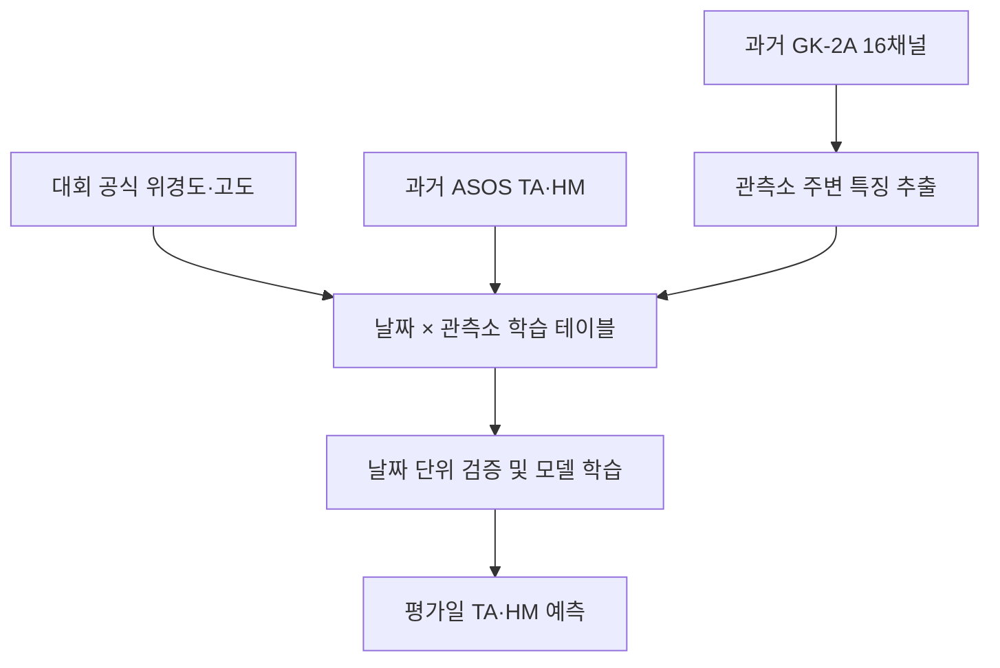

# GK-2A 위성영상 기반 기온·습도 예측

천리안2A호(GK-2A) 위성영상으로 전국 96개 ASOS 관측소의 **14시 기온(TA)**과 **상대습도(HM)**를 예측하는 프로젝트입니다.

이 저장소는 공모전 경험이 많지 않은 3명이 협업하는 것을 전제로, 데이터 수집부터 최종 캐글 노트북 제출까지의 과정을 가능한 한 단순하고 재현 가능하게 구성하는 것을 목표로 합니다.

> 핵심 전략: 처음부터 복잡한 딥러닝 모델을 만드는 것보다, **안정적인 데이터 수집과 검증 체계**를 먼저 완성하고 단순한 모델부터 한 단계씩 개선합니다.

> 공식 제출 규정 반영: 모델 입력은 `LE1B/KO` 16채널, 대회 공식 `station_list.csv`, 날짜·시각·좌표로부터 계산한 값으로 제한합니다. ASOS TA/HM은 학습 라벨로만 사용하며, lag·최근값·지점별 평균·평년값을 특징이나 대체값으로 사용하지 않습니다. 제출 직전 절차는 [SUBMISSION_GUIDE.md](SUBMISSION_GUIDE.md)를 따릅니다.

## 코드부터 실행하려면

처음 참여하는 팀원은 [GETTING_STARTED.md](GETTING_STARTED.md)를 먼저 읽어주세요. API 없이도 아래 순서로 전체 파이프라인을 연습할 수 있습니다.

```bash
pip install -r requirements.txt
pip install -e .
python scripts/create_demo_data.py
python scripts/train_baseline.py --dataset data/processed/demo_train.csv --output models/demo.joblib --experiment-id DEMO
python scripts/make_submission.py --features data/processed/demo_inference_features.csv --model models/demo.joblib --sample-submission data/metadata/demo_sample_submission.csv --output outputs/submissions/demo_submission.csv
```

TA residual 모델의 최근 연도 OOF 보정과 HM CatBoost+residual LSTM 베이스라인은
`notebooks/Colab_TA_HM_OOF_Calibrated_Baseline.ipynb`에서 실행한다. 공식 점수식,
OOF 보정 상수, 규정 입력 검사 결과는 실행 폴더의 `competition_scores.csv`,
`calibration_recipe.json`, `rule_compliance.json`에 저장된다.

현재 코드는 ASOS 수집부터 날짜 그룹 검증, 모델 저장, `pred`·제출 파일 생성까지 구현되어 있습니다. GK-2A API·파일 시각은 UTC 기준으로 확인해 14:00 KST를 05:00 UTC로 요청하도록 설정했습니다. 위경도→픽셀 변환과 채널별 보정은 KO 표본 파일과 대회 `baseline_notebook.ipynb`로 추가 검증해야 합니다.

---

## 1. 대회 한눈에 보기

| 항목 | 내용 |
|---|---|
| 목표 | GK-2A 16채널 위성영상으로 96개 ASOS 지점의 TA·HM 예측 |
| 예측 시각 | 각 날짜 14:00 KST |
| 최종 평가 기간 | 2026년 8월 24일 ~ 8월 30일 |
| 코드 동결 마감 | 2026년 8월 23일 23:59 KST |
| 평가 단위 | 96개 지점 × 7일 = 672행 |
| 평가 지표 | `RMSE_TA + 0.1 × RMSE_HM` |
| 정량평가 | 동결된 캐글 노트북을 운영진이 평가 기간에 재실행 |
| 정성평가 | 모델 로직, 접근 방식, 구현의 타당성 등을 발표 자료로 평가 |

평가 점수는 다음과 같습니다.

$$
\text{Score}=\text{RMSE}_{TA}+0.1\times\text{RMSE}_{HM}
$$

- 점수가 낮을수록 좋습니다.
- TA와 HM의 결측 정답은 각 변수의 평가에서 제외됩니다.
- ASOS 원자료에서 `TA = -99`, `HM = -9`는 결측으로 처리합니다.
- 연습 리더보드 점수는 최종 순위에 반영되지 않습니다.

---

## 2. 문제를 쉽게 이해하기

하루의 데이터가 만들어지는 과정은 다음과 같습니다.

1. 14시의 한반도 위성영상 16장을 받습니다.
2. 각 관측소의 위도·경도를 위성영상의 픽셀 위치로 변환합니다.
3. 관측소 주변 위성값과 통계량을 추출합니다.
4. 과거 같은 시각의 ASOS 기온·습도를 정답으로 붙입니다.
5. 여러 날짜의 데이터를 모아 회귀 모델을 학습합니다.
6. 평가 기간에는 위성영상만으로 96개 관측소의 TA·HM을 예측합니다.



중요한 점은 한 날짜의 96개 행이 모두 같은 위성영상을 공유한다는 것입니다. 따라서 행 수가 많아 보여도 실제로 독립적인 정보의 수는 **수집한 날짜 수**에 더 가깝습니다.

---

## 3. 반드시 지켜야 할 대회 규칙

### 사용할 수 있는 입력

- 천리안2A호 Level 1B 기본관측자료 16개 채널(영역 `KO`)
- 운영진이 제공한 `station_list.csv`의 `STN_ID`, 위도, 경도, 고도
- 날짜·시각·위 좌표에서 계산한 연·월·일, 연중일, 주기 인코딩 등
- 위 항목과 허용된 과거 ASOS 라벨로 부터 만든 파생변수. 단, 아래의 명시적 금지 항목은 제외

### 사용하면 안 되는 입력

- 수치예보모델 출력, ERA5 등 재분석, 타 기관의 기상 관측·예보
- 외부 DEM, 토지피복도, OpenStreetMap, 건물·도로, 인구밀도, 야간조도, 토양자료, 해안선 거리 등 외부 정적 지리정보
- 기후 평년값, 지점별 과거 평균기온 등 관측에서 가공된 정보
- ASOS lag, 최근 관측값, 평가 기간 ASOS 조회값
- `/LE1B/` 이외의 GK-2A API 경로

ASOS API는 **과거 학습 데이터의 TA·HM 라벨 수집에만** 사용합니다. 최종 평가 노트북의 예측 입력으로 ASOS 관측값을 사용하지 않습니다.

최종 제출물은 두 가지입니다.

1. 비공개 Kaggle 추론 노트북과 운영진이 접근 가능한 모델 Dataset
2. 실행 출력이 남아 있는 학습 코드 `.ipynb`

추론 노트북은 운영진이 `PRED_START`, `PRED_END`만 바꾸고 `Run All` 할 수 있어야 합니다. API 키는 Kaggle Secrets가 아니라 최종 비공개 노트북 코드에 직접 입력합니다. GitHub 템플릿에는 실제 키를 절대 넣지 않습니다.

### 팀이 운영진 또는 베이스라인에서 확인할 사항

- 14시 이전 여러 시각의 위성영상을 함께 사용할 수 있는지
- 사전 학습 모델의 허용 범위

파일 시각은 UTC이므로 14:00 KST 자료는 `0500` 파일로 결합합니다. 나머지 규정은 확인 전 임의로 가정하지 않습니다.

---

## 4. 전체 개발 전략

이 프로젝트는 다음 여섯 단계로 진행합니다.

### Stage 0. 수집·좌표 변환 검증

목표는 한 날짜의 데이터가 올바르게 만들어지는지 확인하는 것입니다.

- ASOS 14시 TA·HM 수집
- GK-2A 한 채널 다운로드
- 위성 파일 형식과 보정값 확인
- 위경도 → 위성 픽셀 변환 검증
- 서울·부산·제주 등 몇 개 지점의 위치를 그림으로 확인
- 한 날짜 × 96개 관측소의 테이블 생성

이 단계가 끝나기 전에는 대량 수집을 시작하지 않습니다. 좌표나 시간대가 틀린 상태로 많은 데이터를 받으면 전부 다시 수집해야 할 수 있습니다.

### Stage 1. 공식 정적·날짜 기준 모델

먼저 위성을 사용하지 않는 간단한 기준 성능을 만듭니다.

- 관측소 ID
- 위도·경도·고도
- 연·월·일, 연중일 `sin/cos`

이 모델은 추론 시점에 허용된 입력만 받습니다. ASOS 지점별 평균·lag·평년값은 특징이나 대체값으로 저장하지 않습니다.

### Stage 2. 관측소 중심 픽셀 모델

16개 채널에서 관측소 위치의 중심 픽셀값을 추출해 기준 모델에 추가합니다.

- TA 모델과 HM 모델은 별도로 학습
- CatBoost 또는 LightGBM 같은 테이블 모델부터 실험
- 모델보다 먼저 값의 단위, 결측률, 이상 범위를 점검

### Stage 3. 주변 패치 특징 모델

중심 픽셀 하나는 구름 경계나 좌표 오차에 민감하므로 주변 통계량을 추가합니다.

| 특징 | 예시 |
|---|---|
| 중심값 | 관측소 위치 픽셀값 |
| 주변 통계 | 평균, 표준편차, 최솟값, 최댓값 |
| 분위수 | 10%, 50%, 90% |
| 공간 차이 | 중심값 - 주변 평균 |
| 결측 정보 | 유효 픽셀 비율, 채널 결측 여부 |
| 채널 차이 | `IR105 - IR112`, `IR112 - IR123`, `WV063 - WV073` |

패치 크기는 5km, 15km, 30km처럼 실제 거리 기준으로 비교합니다. 모든 조합을 처음부터 만들지 말고, 작은 특징 세트부터 성능 변화를 기록합니다.

### Stage 4. 직접 예측과 앙상블

TA·HM을 직접 예측하고, 각 모델의 입력이 규정상 허용된 열로만 구성되는지 확인합니다. 지점별 과거 평균이나 평년값을 기준값으로 두는 잔차 모델은 사용하지 않습니다.

- ExtraTrees, CatBoost, LightGBM 등의 직접 TA 예측 비교
- 동일한 허용 특징을 사용한 직접 HM 예측 비교
- 검증에서 독립적으로 성능을 확인한 모델의 단순 앙상블

### Stage 5. 결측 대응과 최종 동결

최종 평가에서는 위성 입력이 일부 또는 전부 없더라도 672개의 예측값이 반드시 존재해야 합니다.

- 일부 채널 결측: 학습 중앙값 대체 + 결측 플래그
- 주변 픽셀 결측: 유효한 픽셀만으로 통계 계산
- 전체 위성 결측: 공식 좌표·고도·날짜만 사용하는 별도 모델으로 예측
- TA/HM 예측 NaN: ASOS 통계로 대체하지 말고 실패 원인을 수정한 뒤 유한값을 생성
- HM: 최종적으로 0~100 범위로 제한
- 제출 행: `sample_submission.csv`의 ID와 순서를 그대로 유지

---

## 5. 데이터 수집 계획

처음부터 전 기간을 받지 않고 다음 우선순위로 수집합니다.

1. 최근 여러 해의 8월 24일~30일
2. 2019~2025년 7월 1일~9월 30일
3. 성능과 수집 시간을 확인한 뒤 5월~10월로 확대
4. 전 기간 수집은 필요성이 확인된 경우에만 진행

7~9월을 2019~2025년까지 수집하면 약 644일입니다. 테이블 행은 약 6만 개이지만, 검증 설계에서는 날짜가 공유된다는 점을 반드시 반영합니다.

### ASOS 라벨 수집

- 날짜마다 14시 전체 지점을 한 번에 요청
- `station_list.csv`의 96개 지점만 남김
- `TA = -99`, `HM = -9`를 NaN으로 변환
- 날짜별 원본 응답 또는 정제 CSV를 캐시
- 정상 응답인지, 지점 수가 지나치게 적지 않은지 검사

### GK-2A 위성 수집

- 날짜 × 16개 채널을 요청
- 영역은 반드시 `KO` 사용
- 임시 파일로 다운로드한 뒤 정상 파일인지 검사
- 특징을 추출한 뒤 원본 삭제 여부 결정
- 실패한 HTML 응답이나 빈 파일을 정상 데이터로 캐시하지 않음
- 재시도 횟수와 실패 날짜를 로그로 저장

### 개발용 키와 제출용 키 관리

개발 중 API 키는 GitHub에 절대 커밋하지 않습니다.

```python
import os

KMA_API_KEY = os.environ["KMA_API_KEY"]
```

로컬 개발·학습에서는 `.env`를 사용합니다. 공식 제출 규정에 따라 최종 Kaggle 추론 노트북에만 API 키를 문자열로 직접 입력합니다. 이 최종 노트북은 비공개로 유지하고 GitHub로 되가져오지 않습니다.

```gitignore
.env
secrets.json
data/raw/
data/cache/
models/
*.log
```

이미 채팅, 공개 저장소 또는 공개 노트북에 노출된 키는 폐기하고 재발급하는 것이 안전합니다.

모델 Dataset에는 API 키뿐 아니라 ASOS 수집 코드도 넣지 않습니다. `scripts/build_inference_dataset.py`가 추론에 필요한 파일만 허용 목록으로 복사합니다.

---

## 6. 학습 테이블 예시

최종적으로 한 행은 한 날짜의 한 관측소를 나타냅니다.

```text
date, STN_ID, latitude, longitude, altitude,
day_sin, day_cos,
VI004_center, VI004_mean_5km, VI004_std_15km,
...
IR105_center, IR112_center, IR105_minus_IR112,
...
TA, HM
```

| 컬럼 그룹 | 역할 |
|---|---|
| `date`, `STN_ID` | 행 식별 및 날짜 그룹 검증 |
| 위도·경도·고도 | 정적 지리 특징 |
| 날짜 `sin/cos` | 계절성 표현 |
| 채널 중심값 | 관측소 위치의 위성 정보 |
| 패치 통계 | 관측소 주변 구름·지표 상태 요약 |
| 채널 차이 | 채널 간 물리적 관계 표현 |
| 결측 플래그 | 위성 누락 상태를 모델에 알림 |
| `TA`, `HM` | 과거 ASOS에서 수집한 학습 정답 |

가능하면 원시 DN 값 그대로가 아니라 채널에 맞게 보정된 값을 사용합니다.

- 가시·근적외 채널: 반사도
- 적외·수증기 채널: 휘도온도

정확한 변환 방식은 베이스라인 노트북과 파일 메타데이터를 먼저 확인합니다.

---

## 7. 검증 방법

### 하지 말아야 할 방법: 행 단위 랜덤 분할

같은 날짜의 96개 관측소 중 일부가 학습, 일부가 검증에 들어가면 같은 위성영상 정보가 양쪽에 섞입니다. 이 경우 실제 평가보다 검증 점수가 지나치게 좋게 나올 수 있습니다.

### 기본 검증: 날짜 기준 그룹 분할

```python
from sklearn.model_selection import GroupKFold

groups = train_df["date"]
cv = GroupKFold(n_splits=5)
```

### 최종 상황 모의: 연도 홀드아웃

- 예: 2019~2024년 학습, 2025년 검증
- 가능하면 각 연도의 8월 24~30일을 번갈아 검증
- 최종 평가와 유사한 계절·기간에서 성능 확인

### 평가 함수

```python
import numpy as np
from sklearn.metrics import mean_squared_error


def competition_score(y_ta, pred_ta, y_hm, pred_hm):
    ta_mask = np.isfinite(y_ta)
    hm_mask = np.isfinite(y_hm)

    rmse_ta = mean_squared_error(
        y_ta[ta_mask], pred_ta[ta_mask]
    ) ** 0.5
    rmse_hm = mean_squared_error(
        y_hm[hm_mask], pred_hm[hm_mask]
    ) ** 0.5

    return {
        "rmse_ta": rmse_ta,
        "rmse_hm": rmse_hm,
        "score": rmse_ta + 0.1 * rmse_hm,
    }
```

TA와 HM의 결측 마스크는 서로 다를 수 있으므로 각각 따로 적용합니다.

---

## 8. 실험 순서와 기록 방식

복잡한 모델 하나를 오래 만드는 것보다, 아래 순서대로 하나씩 추가하며 점수 변화를 기록합니다.

| 실험 ID | 내용 | 목적 |
|---|---|---|
| B0 | 공식 좌표·고도 + 날짜 모델 | 허용 입력만으로 최소 기준 성능 확보 |
| B1 | B0 + 16채널 중심값 | 위성 정보의 기본 효과 확인 |
| B2 | B1 + 5km·15km 주변 패치 통계 | 공간 정보 효과 확인 |
| B3 | B2 + 채널 차이·결측 특징 | 물리 관계와 누락 대응 확인 |
| B4 | 다른 직접 회귀 모델 앙상블 | 일반화 성능 개선 |

`experiments/experiment_log.csv`에는 최소한 다음 항목을 기록합니다.

```text
experiment_id,date,owner,data_version,features,model,validation,
rmse_ta,rmse_hm,score,seed,runtime,notes,commit_hash
```

실험을 채택할 때는 한 번의 점수만 보지 않고 다음을 함께 확인합니다.

- 여러 fold에서 일관되게 좋아졌는가?
- TA와 HM 중 한쪽만 크게 나빠지지 않았는가?
- 실행 시간과 메모리 제한 안에 들어오는가?
- 위성 결측 상황에서도 예측이 가능한가?
- 팀원이 같은 커밋에서 같은 결과를 재현할 수 있는가?

---

## 9. 추천 저장소 구조

```text
.
├── README.md
├── requirements.txt
├── .gitignore
├── configs/
│   ├── data.yaml
│   └── model.yaml
├── data/
│   ├── raw/                  # 원본 API 파일, Git 제외
│   ├── interim/              # 날짜별 정제 데이터, Git 제외
│   ├── processed/            # 학습 테이블, 대용량이면 Git 제외
│   └── metadata/
│       └── station_list.csv
├── notebooks/
│   ├── 01_api_check.ipynb
│   ├── 02_coordinate_check.ipynb
│   ├── 03_initial_eda.ipynb
│   ├── 04_baseline.ipynb
│   └── 99_final_inference.ipynb
├── src/gk2a_weather/
│   ├── config.py
│   ├── kaggle.py
│   ├── data/
│   │   ├── asos.py
│   │   ├── gk2a.py
│   │   ├── http.py
│   │   └── stations.py
│   ├── features/
│   │   ├── dataset.py
│   │   ├── satellite.py
│   │   └── static.py
│   ├── models/
│   │   ├── bundle.py
│   │   ├── train.py
│   │   ├── predict.py
│   │   └── evaluate.py
│   └── utils/
│       ├── io.py
│       └── logging.py
├── scripts/
│   ├── check_setup.py
│   ├── create_demo_data.py
│   ├── collect_labels.py
│   ├── collect_satellite.py
│   ├── extract_satellite_features.py
│   ├── build_dataset.py
│   ├── train_baseline.py
│   ├── make_submission.py
│   ├── build_inference_dataset.py
│   └── audit_submission.py
├── notebooks/
│   └── kaggle_inference_template.ipynb
├── SUBMISSION_GUIDE.md
├── experiments/
│   └── experiment_log.csv
├── models/                   # 학습 가중치, Git 제외 또는 별도 관리
├── outputs/
│   ├── figures/
│   └── submissions/
└── tests/
    ├── test_asos_parser.py
    ├── test_coordinates.py
    └── test_submission.py
```

최종 추론은 `notebooks/kaggle_inference_template.ipynb`를 기준으로 만들고, 제출 전 [SUBMISSION_GUIDE.md](SUBMISSION_GUIDE.md)의 자동 감사와 비공개 `Copy & Edit → Run All` 검수를 수행합니다.

---

## 10. 실행 흐름

### 1) 환경 만들기

```bash
python -m venv .venv
```

Windows PowerShell:

```powershell
.\.venv\Scripts\Activate.ps1
```

macOS/Linux:

```bash
source .venv/bin/activate
```

```bash
pip install -r requirements.txt
pip install -e .
```

### 2) 환경변수 설정

```text
KMA_API_KEY=발급받은_키
```

### 3) 소량 데이터로 파이프라인 검증

```bash
python scripts/collect_labels.py --start 2025-08-24 --end 2025-08-25
python scripts/collect_satellite.py --start 2025-08-24 --end 2025-08-25
python scripts/build_dataset.py
python scripts/train_baseline.py
```

### 4) 검증 성공 후 수집 범위 확대

```bash
python scripts/collect_labels.py --start 2019-07-01 --end 2025-09-30
python scripts/collect_satellite.py --start 2019-07-01 --end 2025-09-30
```

위 명령의 인자와 실제 파일명은 구현 과정에서 바뀔 수 있습니다. README와 코드가 서로 어긋나지 않도록 변경 시 함께 수정합니다.

---

## 11. 3명 역할 분담

세 명 모두 공모전이 처음이므로, 한 사람만 전체 파이프라인을 아는 구조를 피합니다. 각자 주 담당은 두되, 매일 다른 한 명이 결과를 재현하거나 검수합니다.

| 담당 | 주 업무 | 교차 검수 |
|---|---|---|
| 팀원 A: 데이터 | ASOS/GK-2A 수집, 캐시, 재시도, 좌표 변환 | 팀원 B가 샘플 날짜 재현 |
| 팀원 B: 특징·분석 | EDA, 위성 패치 특징, 이상치·결측 분석 | 팀원 C가 특징 정의 검토 |
| 팀원 C: 모델·제출 | 검증, 모델 학습, 앙상블, 제출 노트북 | 팀원 A가 새 환경에서 실행 |

### 공동 책임

- 데이터 사용 규칙 확인
- 실험 결과 기록
- 코드 리뷰
- 최종 캐글 노트북 전체 실행
- 정성평가 발표 자료의 근거 정리

### 추천 일일 협업 방식

1. 오전 또는 작업 시작 전 10분: 오늘 할 일과 막힌 점 공유
2. 각자 한 번에 1~2개의 작은 이슈만 담당
3. 작업 완료 후 Pull Request 생성
4. 다른 한 명이 코드와 실행 결과 검수
5. 하루 종료 전 실험표와 실패 로그 업데이트

역할은 고정 신분이 아니라 해당 작업의 책임자입니다. 데이터 담당도 모델 코드를 한 번 실행하고, 모델 담당도 API 수집 흐름을 이해해야 합니다.

---

## 12. GitHub 협업 규칙

### 브랜치 이름

```text
feat/asos-collector
feat/satellite-patch
experiment/catboost-baseline
fix/timezone-conversion
docs/update-readme
```

### 커밋 메시지

```text
feat: add ASOS 14KST collector
fix: handle invalid satellite response
exp: compare 5km and 15km patch features
docs: document validation strategy
```

### Pull Request에 반드시 적을 내용

- 무엇을 변경했는가?
- 왜 변경했는가?
- 어떻게 실행하고 확인했는가?
- 점수 또는 결과가 어떻게 달라졌는가?
- 남아 있는 문제는 무엇인가?

### 금지 사항

- API 키 커밋
- 검수 없이 `main`에 직접 작업
- 출처와 생성 과정을 알 수 없는 대용량 데이터 업로드
- 결과 기록 없이 노트북 셀만 반복 실행
- 다른 팀원의 코드를 설명 없이 대규모로 덮어쓰기

---

## 13. 일정: 2026년 8월 9일 ~ 23일

| 기간 | 목표 | 완료 조건 |
|---|---|---|
| 8/9~10 | API·시간대·좌표 검증 | 한 날짜 96개 지점 테이블과 위치 그림 확인 |
| 8/9~13 | 과거 여름철 데이터 수집 | 실패 날짜 목록과 재시도 가능한 캐시 완성 |
| 8/11~14 | B0·B1 기준 모델 | 날짜 단위 검증 점수 확보 |
| 8/14~17 | 16채널 중심값·패치 특징 | B2·B3 실험표 작성 |
| 8/17~19 | 잔차 모델·채널 차이 | 후보 모델 2~3개 선정 |
| 8/19~20 | 앙상블·결측 테스트 | 채널/전체 위성 누락에도 제출 생성 |
| 8/21 | 최종 코드 정리 | 가중치 확정, 최소 추론 Dataset 생성·감사 |
| 8/22 | 새 세션 전체 재실행 | 운영진 방식의 날짜 변경 후 `pred` 생성 성공 |
| 8/23 | 두 제출물 동결·업로드 | 캐글 Save Version과 학습 `.ipynb` 구글폼 업로드 완료 |

마감일에는 새로운 특징이나 모델을 추가하지 않습니다. 8월 22일부터는 재현성과 오류 방지에 집중합니다.

---

## 14. 첫 회의에서 결정할 것

첫 회의는 다음 항목만 결정해도 충분합니다.

1. 세 명의 첫 주 담당 영역
2. GitHub 저장소와 브랜치 규칙
3. 공통 Python 버전과 실행 환경
4. API 승인 상태와 키 보관 방법
5. 위성 시각·좌표 변환의 확인 방법
6. 첫 수집 범위: 2025년 8월 24~30일
7. 매일 진행 상황을 공유할 시간
8. 실험표를 업데이트할 담당 방식

### 첫날 할 일

- [ ] 세 명 모두 저장소 clone 및 가상환경 생성
- [ ] `.gitignore`에 비밀키와 대용량 폴더 등록
- [ ] ASOS API 한 날짜 응답 저장 및 파싱
- [ ] GK-2A 한 채널 다운로드
- [ ] `station_list.csv`의 지점 수와 컬럼 확인
- [ ] 베이스라인의 시간대·좌표 변환 코드 읽기
- [ ] GitHub Issue 3개를 만들고 한 명당 하나씩 담당

---

## 15. 최종 제출 노트북 체크리스트

최종 노트북은 모델을 새로 학습하는 용도가 아니라, 저장된 가중치로 안정적으로 추론하는 용도로 구성합니다.

- [ ] 첫 코드 셀 최상단에 `PRED_START`, `PRED_END` 배치
- [ ] 최종 비공개 노트북에 `API_KEY`를 문자열로 직접 입력
- [ ] Kaggle Secrets 미사용
- [ ] 날짜를 `pd.date_range(PRED_START, PRED_END)`로 생성
- [ ] 평가 기간 ASOS/AWS 조회 코드가 노트북과 Dataset에 없음
- [ ] 추론 중 `.fit()`이나 튜닝을 수행하지 않음
- [ ] 각 평가일의 GK-2A 16개 채널 다운로드
- [ ] 다운로드 실패 자동 재시도
- [ ] 파일 크기·형식·유효 픽셀 검사
- [ ] 학습 때와 동일한 특징 생성
- [ ] 저장된 TA·HM 모델 로드
- [ ] 일부 채널 결측 처리
- [ ] 전체 위성 결측 시 기준 모델 사용
- [ ] TA·HM NaN 제거
- [ ] HM을 0~100으로 제한
- [ ] `pred` 행 수를 `날짜 수 × 관측소 수`로 동적 검사
- [ ] 같은 입력으로 다시 실행했을 때 같은 결과 생성
- [ ] 비공개 `Copy & Edit`에서 날짜만 변경하고 `Run All` 성공
- [ ] 실행 시간과 디스크 사용량 제한 확인
- [ ] API 키가 출력이나 로그에 노출되지 않는지 확인
- [ ] 모델 Dataset이 운영진 계정에서 접근 가능
- [ ] 실행 출력이 남은 학습 `.ipynb`를 별도 업로드

간단한 제출 검사는 코드로 강제합니다.

```python
expected_rows = len(pred_dates) * len(stations)
assert len(pred) == expected_rows
assert pred[["TA", "HM"]].notna().all().all()
assert pred["HM"].between(0, 100).all()
```

제출용 최소 Dataset과 자동 점검은 다음 명령으로 만듭니다.

```bash
python scripts/build_inference_dataset.py
python scripts/audit_submission.py \
  --notebook kaggle_cell2_template.py \
  --dataset-dir outputs/kaggle_dataset \
  --allow-placeholder
```

---

## 16. 주요 위험과 대응

| 위험 | 증상 | 대응 |
|---|---|---|
| 시간대 오류 | 모델 성능이 낮고 채널-기온 관계가 이상함 | KST/UTC 변환을 샘플 날짜로 직접 검증 |
| 좌표 변환 오류 | 모든 관측소 값이 비슷하거나 바다 픽셀 추출 | 알려진 도시 위치를 영상 위에 표시 |
| API 실패 파일 캐시 | 재실행해도 계속 같은 날짜가 실패 | 임시 저장 후 검증 성공 파일만 캐시 |
| 랜덤 분할 누수 | CV는 매우 좋지만 연도 홀드아웃은 나쁨 | 날짜 기준 GroupKFold 사용 |
| 수집 지연 | 모델 실험용 날짜가 부족함 | 평가 계절과 가까운 기간부터 우선 수집 |
| 과도한 특징 수 | 학습이 느리고 fold별 성능이 불안정 | 특징군을 한 번에 하나씩 추가 |
| 최종 위성 결측 | NaN 예측 또는 672행 미생성 | 공식 좌표·고도·날짜 보조 모델 사용 |
| 팀원 환경 차이 | 한 명의 컴퓨터에서만 실행됨 | 버전 고정, 새 환경 재현, PR 교차 검수 |

---

## 17. 정성평가를 위한 기록

정성평가에서는 최고 점수만 제시하는 것보다 왜 그런 설계를 했는지 설명할 수 있어야 합니다. 개발 중 다음 자료를 계속 저장합니다.

- B0부터 최종 모델까지의 성능 변화 표
- 중심 픽셀과 패치 특징의 비교
- 채널별 결측률과 중요도
- 날짜 그룹 검증과 랜덤 분할의 차이
- 위성 일부/전체 결측 스트레스 테스트
- TA·HM 예측 산점도와 지점별 오차 지도
- 실패한 접근과 제외한 이유
- 모델 실행 시간, 메모리, 파일 용량

발표에서는 “복잡한 모델을 사용했다”보다 다음 흐름이 더 중요합니다.

1. 문제와 데이터 구조를 올바르게 이해했다.
2. 누수가 없는 검증 방법을 사용했다.
3. 위성 채널과 공간 특징을 합리적으로 설계했다.
4. 결측과 API 실패를 실제 평가 환경 기준으로 대비했다.
5. 각 개선이 검증 점수에 미친 영향을 실험으로 확인했다.

---

## 18. 용어 정리

| 용어 | 의미 |
|---|---|
| ASOS | 기상청 종관기상관측소 |
| GK-2A | 천리안2A호 정지궤도 기상위성 |
| 채널 | 서로 다른 파장대에서 촬영한 위성영상 |
| TA | 지상 기온, 단위 °C |
| HM | 상대습도, 단위 % |
| 피처 | 모델이 예측에 사용하는 입력값 |
| 라벨 | 모델이 맞혀야 하는 과거 정답 TA·HM |
| 패치 | 관측소 중심 주변의 작은 영상 영역 |
| RMSE | 큰 오차에 더 큰 벌점을 주는 회귀 평가 지표 |
| Cross-validation | 데이터를 여러 번 나누어 일반화 성능을 확인하는 방법 |
| 데이터 누수 | 실제 예측 때 알 수 없는 정보가 학습·검증에 섞이는 문제 |
| 보조 모델 | 위성 누락 시 공식 좌표·고도·날짜만으로 예측하는 별도 모델 |
| 코드 동결 | 마감 시점의 코드를 저장하고 이후 운영진이 그대로 재실행하는 방식 |

---

## 19. 프로젝트 완료 기준

다음 조건을 모두 만족하면 제출 준비가 완료된 것으로 봅니다.

- 날짜 단위 검증 점수가 기록되어 있다.
- 데이터 수집과 특징 추출을 중단 후 재시작할 수 있다.
- 모델 가중치와 특징 생성 코드의 버전이 일치한다.
- 위성 일부 또는 전체가 없어도 모든 ID의 예측이 생성된다.
- 세 명 중 최소 두 명의 환경에서 전체 추론이 재현된다.
- 새 캐글 세션에서 672행 제출 파일 생성에 성공한다.
- API 키와 대용량 원본 데이터가 GitHub에 포함되지 않는다.
- 최종 추론 Dataset에 ASOS 수집 코드와 학습 코드가 포함되지 않는다.
- 운영진이 날짜 변수만 수정해 `Run All` 할 수 있다.
- 실행 출력이 남은 학습 `.ipynb` 업로드가 완료되어 있다.
- 최종 선택 모델의 근거를 실험표와 그림으로 설명할 수 있다.

우리 팀의 첫 번째 목표는 높은 점수가 아니라 **끝까지 실행되는 기준 파이프라인**입니다. 그 파이프라인이 완성된 뒤에만 특징과 모델을 하나씩 추가합니다.
